BIG-IQ Device Management
========================

The following workflows will get you familiar with the BIG-IQ for
management of BIG-IP devices specific to managing Access Policy Manager.
This course is not intented to walk through all the required steps to
implement BIG-IQ and setup logging and statistics collection. That
information can be referenced from the BIG-IQ CM Implementation Guide.
For this BIG-IQ Access lab we will proceed to general ADC management
tasks (importing a BIG-IP and managing its configuration).

WORKFLOW 1: Removing Previously Discovered devices for this LAB Exercise 
~~~~~~~~~~~~~~~~~~~~~~~~~~~~~~~~~~~~~~~~~~~~~~~~~~~~~~~~~~~~~~~~~~~~~~~~~

Since this Self Guided Lab started with the BIG-IQ pre populated with
the BIG-IP devices for the previous exercises we must now remove some of
those devices before continuing on to the next workflow.

Navigate to the top menu Devices tab then on the left menu select BIG-IP
Devices

Place a check in the box next to BOS-vBIGIP01.termmarc.com and
BOS-vBIGIP02.termmarc.com

Now click the Remove All Services button.

Navigate to the Devices Tab then BIG-IP Clusters menu then Access Groups
sub-menu

Verify if the Boston Access Group still exists and if so do the
following task otherwise skip to next step.

Place a check in the box next to BOSTON and click the REMOVE button

Navigate to BIG-IP Clusters -> DSC Groups

If there are any datasync groups from either of the BOS devices shown
then click the Refresh List button and verify they are removed.

Navigate to Devices -> Device Groups menu

Verify the BostonDC group is gone, if not place a check in the box next
to BostonDC and click the Delete button.

You can logon to both the BOS-vBIGIP01.termmarc.com and
BOS-vBIGIP02.termmarc.com devices locally and verify they are no longer
showing that they are managed by BIG-IQ

WORKFLOW 2: Importing BIG-IP devices for management and inventory (REQUIRED)
~~~~~~~~~~~~~~~~~~~~~~~~~~~~~~~~~~~~~~~~~~~~~~~~~~~~~~~~~~~~~~~~~~~~~~~~~~~~

Time to complete: 15 Minutes

The first step of managing devices with BIG-IQ is device discovery. The
basic discovery allows for device inventory, device health monitoring,
backup and restore of the managed device, integration with F5’s iHealth
service, software upgrade, and device template deployment. As part of
the discovery process, you can choose to manage other parts of the
BIG-IP configuration.

In this scenario, we will import a pair (clustered) of BIG-IP devices,
review the device information available in BIG-IQ, export our inventory
to a CSV file, and review that.

    Adding devices to BIG-IQ Inventory:

***Dependencies: ***

1. The BIG-IP device must be located in your network.

2. The BIG-IP device must be running a compatible software version.

***BIG-IP Versions***

+------------------------------+------------------------------+
| **Functional Description**   | **Minimum BIG-IP version**   |
+==============================+==============================+
| Backup/Restore               | 11.5.0 HF7                   |
+------------------------------+------------------------------+
| Upgrade - legacy devices     | 10.2.0                       |
+------------------------------+------------------------------+
| Upgrade - managed devices    | 11.5.0 HF7                   |
+------------------------------+------------------------------+
| Licensing BIG-IP VE          | 11.5.0 HF7                   |
+------------------------------+------------------------------+
| Licensing - WebSafe          | 12.0.0                       |
+------------------------------+------------------------------+
| ADC management               | 11.5.1 HF4                   |
+------------------------------+------------------------------+
| AFM                          | 11.5.2                       |
+------------------------------+------------------------------+
| Access                       | 12.1.0                       |
+------------------------------+------------------------------+
| ASM                          | 11.5.3 HF1                   |
+------------------------------+------------------------------+
| DNS                          | 12.0.0                       |
+------------------------------+------------------------------+

 

AskF5 SOL with this info:
https://support.f5.com/kb/en-us/solutions/public/14000/500/sol14592.html

1. Port 22 and 443 must be open to the BIG-IQ management address, or any
   alternative IP address used to add the BIG-IP device to the BIG-IQ
   inventory.

Big-IP Devices
^^^^^^^^^^^^^^

Adding a BIG-IP device to the BIG-IQ system inventory is the first step
to management. First, we will be adding an HA pair of devices to be
managed in BIG-IQ.

**\*\*Important-** Before you attempt to add the BIG-IP cluster
(***BOS-vBIGIP01.termmarc.com*** and ***BOS-vBIGIP02.termmarc.com***),
make sure that the devices are **‘In Sync’** from a configuration
standpoint or you will get an error when attempting to import. You will
need to access one of the devices directly to do this. Log in to either
**BOS-BIGIP** from the UDF Components page and sync the configs\ **.**

\*\*DO NOT SKIP THE ABOVE STEP\*\*

1. Log in to the BIG-IQ system with your user name (admin) and password
   (admin).

2. On the top menu bar, select **Devices** from the BIG-IQ menu.

3. On the left-hand menu bar, click **BIG-IP Devices**.

4. Click the **Add Device** button in the main pane.

   a. In the **IP Address (10.1.1.10)** field, type the IPv4 or IPv6
      address of the device.

   b. In the **User Name** and **Password** fields, type the user name
      (admin) and password (admin) for the device.

   c. Cluster Display Name: Select **Create New.**

   d. Name the cluster **BostonCluster**

   e. Leave the **‘Initiate..’** radio button checked

|image42|

1. Click the Add button to add this device to BIG-IQ.

2. BIG-IQ now exchanges certs with the BIG-IP and pops up a window for
   the administrator to select which modules to manage from BIG-IQ. For
   this device, select all services except **Fraud Protection
   Services.** Leave the Statistics monitoring boxes all checked, and
   then click the **Continue** button.

    |image43|

1. The discovery process will start and you should see a screen like
   this. At this point, BIG-IQ is using REST calls to the BIG-IP to pull
   the selected parts of the BIG-IP configuration into BIG-IQ.

|image44|

While the discovery process is happening for the first device, add the
second device to BIG-IQ:

1. Click the **Add Device** button.

   a. In the **IP Address (10.1.1.11)** field, type the IPv4 or IPv6
      address of the device.

   b. In the **User Name** and **Password** fields, type the user name
      (admin) and password (admin) for the device.

   c. Cluster Display Name: Select **Use Existing.**

   d. Select **BostonCluster** from the list of existing clusters.

   e. Leave the **‘Initiate..’** radio button checked

2. Click the Add button to add this device to BIG-IQ.

3. For this device, again, select all services except **Fraud Protection
   Services.** Leave the Statistics monitoring boxes all checked, and
   then click the **Continue** button.

Allow the import jobs to complete. At this point, the configuration of
the BIG-IPs that have been imported are not yet editable in BIG-IQ. To
make the configurations editable in BIG-IQ, we need to |image45|.

1. On the Device Inventory screen, click the |image46|\ link in the
   Services column for **BOS-vBIGIP01**. *(you may need to scroll right
   to see the services column*)

|image47|

1. In the Local Traffic (LTM) Section, select the check box for “Create
   a snapshot of the current configuration before importing” and click
   the **Import** button.

|image48|

1. Before proceeding un-check the LTM snapshot box if still checked. In
   the Access Policy (APM) Section, select the check box for “Create a
   snapshot of the current configuration before importing” and click the
   **Import** button.

|image49|

a. BIG-IQ Access has its own notion of device grouping called “Access
   Groups” where you define a “Source Device” where configuration
   changes can be made and deployed to the other devices in the Access
   Group. Create a new Access Group by choosing **Create** New from the
   Access Group drop-down. Then name the new group **BostonAG**, and
   Click the Add button to continue.

    |image50|

1. In the Application Security (ASM) Section, select the check box for
   “Create a snapshot of the current configuration before importing” and
   click the **Import** button.

|image51|

a. In step 14, you will experience “Conflict Resolution.” A conflict is
   when an object that is already in the BIG-IQ working config has the
   same name, but different contents as an object that exists on the
   BIG-IP that is being imported. The user must select whether to keep
   the object from BIGIP or BIGIQ configuration. Storage will be updated
   accordingly. Review the differences that have been discovered as part
   of this import by clicking on each row in the difference view.

|image52|

a. In this lab, we are going to choose to keep the version of the object
   that is already in the BIG-IQ. Click the continue button.

b. A window reminds us that these conflict resolution selections will
   not modify the configuration that is running on this BIG-IP until we
   deploy changes from BIG-IQ. Click the Resolve button to continue.

    |image53|

1. In the Advanced Firewall (AFM) Section, select the check box for
   “Create a snapshot of the current configuration before importing” and
   click the **Import** button.

|image54|

a. Again, you will experience the conflict resolution screens. Choose to
   keep the objects that are already on the BIG-IQ.

1. In the BIG-IP (DNS) Section, click the **Import** button.

|image55|

1. | Click the back arrow button at the top of the section to return to
     the inventory.
   | |image56|

2. Repeat steps 11-20 for BOS-vBIGIP02

|image57|

-  For the APM import, make sure to choose **Add to existing** for the
   Access Group and select the **BostonAG.** Accept any conflicts.

1. Once you have completed all of the import tasks for **BIGIP02**,
   click the arrow in the upper left of the Services panel to return to
   the device inventory screen.

   |image58|

2. Click on the **BOS-vBIGIP01.termmarc.com** device link to review the
   device Properties, Health, and Services information for the device.
   |image59|

3. Click through the Properties, Health, Statistics Collection, and
   Services tabs to review the information.

4. | Click the arrow in the upper left of the Services panel to return
     to the device inventory screen.
   | |image60|

5. Repeat steps 20-22 for the other devices, if you wish.

6. Click the Export Inventory button in the main pane to review the
   contents of the device inventory CSV file

7. The CSV file is automatically downloaded to your client. Launch the
   CSV file from your downloads folder. For example, in Chrome the CSV
   file will appear in the lower left. |image61|

8. Review the contents of the file and understand all of the information
   that is provided.

   |image62|

WORKFLOW 5: Automating device backups and archiving a copy of the backup file 
~~~~~~~~~~~~~~~~~~~~~~~~~~~~~~~~~~~~~~~~~~~~~~~~~~~~~~~~~~~~~~~~~~~~~~~~~~~~~~

Time to Complete: 5 min

BIG-IQ provides the ability to backup individual or groups of managed
devices on an ad-hoc or a scheduled basis. The admin can decide how long
to retain the backups on BIG-IQ and has the option of archiving a copy
of the UCS backup off to an external device for DR or deeper storage
purposes.

In this scenario, we are going to create a group of all of the devices
in our Boston data center and schedule a nightly backup that archives a
copy off to our archive for DR purposes.

First, we need to create the group for our backup schedule to reference.
We have two options in BIG-IQ: static groups, where devices are added
and removed manually and dynamic groups, where devices are selected from
a source group based on filter criteria. In this lab setup, the devices
have BOS in the name to indicate that they are in the Boston data
center. This makes the dynamic group the logical choice.

1. On the top menu bar, select **Devices** from the BIG-IQ menu.

2. Click **Device Groups** in the left-hand menu

3. Click **Create** in the main pane

4. | Complete the settings to create the group.
   | Name: **BostonDCGroup**
   | Group Type: **Dynamic**
   | Parent Group: **Root (All BIG-IP Devices)**
   | Search Filter: **BOS**
   | |image63|

5. Click the **Save & Close** button to save the group.

Now, we can create our backup schedule that references this dynamic
group.

1. Click on the **Back Up & Restore** on the left-hand menu

2. Click on **Backup Schedules**

   |image64|

3. Click the **Create** button in the main pane

4. | Fill out the Backup Schedule
   | Name: **BostonNightly**
   | Local Retention Policy: **Delete local backup copy 3 days after
     creation**
   | Backup Frequency: **Daily**
   | Start Time 00:00 Eastern Standard Time

   Under Devices, select the **Groups** radio button

   | Select from the drop-down **BostonDCGroup**
   | Archive: **Store Archive Copy of Backup**
   | Location: **SCP**
   | IP Address: **10.1.10.80**
   | User name: f5
   | Password: default
   | Directory: /home/f5

|image65|

|image66|

1. Click **Save & Close** to save the scheduled backup job.

WORKFLOW 6: Uploading QKviews to iHealth for a support case
~~~~~~~~~~~~~~~~~~~~~~~~~~~~~~~~~~~~~~~~~~~~~~~~~~~~~~~~~~~

Time to Complete: 10 min

BIG-IQ can now push qkviews from managed devices to ihealth.f5.com and
provide a report of heuristic hits based on the qkview. These qkview
uploads can be performed ad-hoc or as part of a F5 support case. If a
support case is specified in the upload job, the qkview(s) will
automatically be associated/linked to the support case.

1. Navigate to **Monitoring** on the top menu bar and then to
   **REPORTS-> Device-> iHealth** -> **Configuration** on the left-hand
   menu\ **.**

   |image67|

2. | Add Credentials to be used for the qkview upload and report
     retrieval. Click the Add button under Credentials.
   | |image68|

3. | Fill in the credentials that you used to access
     https://ihealth.f5.com :
   | Name: **Give the credentials a name to be referenced in BIG-IQ**
   | Username: **<Username you use to access iHealth.f5.com>**
   | Password: **<Password you use to access iHealth.f5.com**>

4. | Click the Test button to validate that your credentials work.
   | |image69|

5. Click the **Save & Close** button in the lower right.

6. | Click the **Tasks** button in the BIG-IQ iHealth menu.
   | |image70|

7. | Click the **QKView Upload** button to select which devices we need
     to upload QkViews from:
   | |image71|

8. | Fill in the fields to upload the QkViews to iHealth.
   | Name: **QKViewUpload5346** (append the last 4 digits of your cell
     number to make this request unique)
   | Credentials: **<Select the credentials you just stored in step 5>**
   | Devices: Select **ip-10-1-1-7.us-west-2.compute.internal**

|image72|

1. Click the **Save & Close** button in the lower right. The task will
   be started immediately.

   \*Note that you can also schedule QKview uploads on a regular basis
   using the **QKView Upload Schedules** on the left menu bar

2. | Click on the name of you upload job to get more details
   | |image73|

3. Observe the progress of the Qkview creation, retrieval, upload,
   processing, and reporting. This operation can take some time, so you
   may want to move on to the next exercise and come back.

4. | Once a job reaches the Finished status, click on the Reports menu
     to review the report.
   | |image74|

5. | Select the report you just created and click the **Open** hyperlink
     under the Report Column
   | |image75|

6. You can also run the Upgrade Advisor from the BIG-IQ if you are
   running an older version of code. Select **Upgrade Advisor Reports**
   from the left-hand menu bar and then click the **Create** button in
   the main window pane.

7. Give your Upgrade Advisor Task a name and select the **ip-10-1-1-7**
   device. Choose your Target Version and then **Save & Close**

8. Click on the **Upgrade Advisor Reports** on the left-hand menu bar
   and your new report should show up shortly. You can see the status of
   the report generation by clicking **Tasks** on the left-hand
   menu-bar. Click on the **Target Software Version** column to view
   your results.

Now is a good time to circle back and see if any statistics have been
created for our BIG-IP inventory.

Navigate to the monitoring dashboards to validate that statistics are being collected and displayed for the BIG-IP devices.
^^^^^^^^^^^^^^^^^^^^^^^^^^^^^^^^^^^^^^^^^^^^^^^^^^^^^^^^^^^^^^^^^^^^^^^^^^^^^^^^^^^^^^^^^^^^^^^^^^^^^^^^^^^^^^^^^^^^^^^^^^^

-  Navigate to **MonitoringDashboards** **Device** **Health** to verify
   that the graphs are populated.

   |image76|

-  We are going to move on to other parts of the lab while we collect
   some stats and then we will circle back when we have more data to
work with.

.. |image42| image:: media/image41.png
   :width: 6.49097in
   :height: 3.43542in
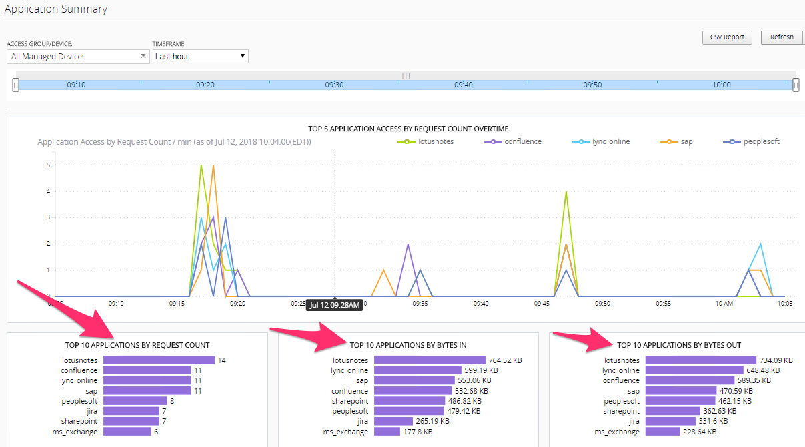
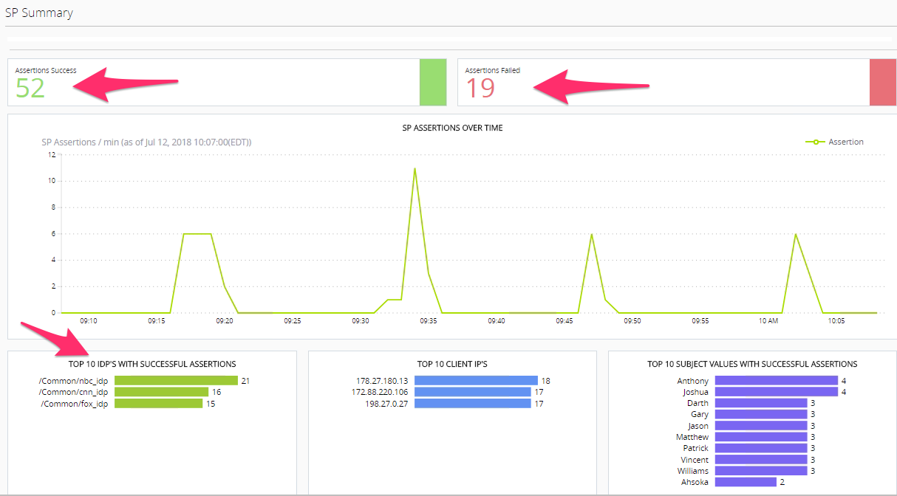
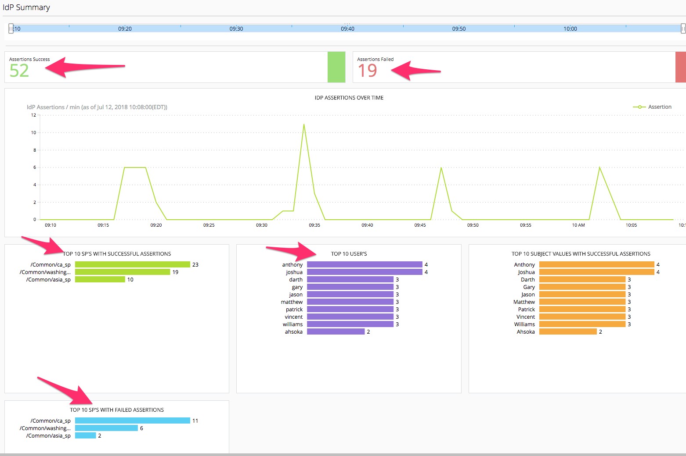

.. |image47| image:: media/image45.png
   :width: 6.50000in
   :height: 1.30833in
.. |image48| image:: media/image46.png
   :width: 6.50000in
   :height: 1.04444in
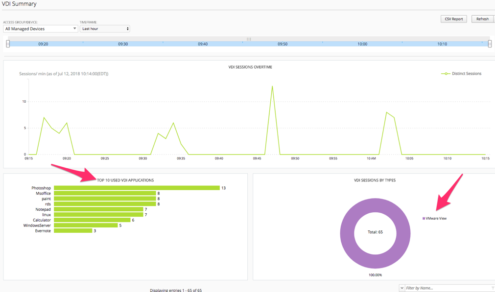
.. |image50| image:: media/image48.png
   :width: 4.93125in
   :height: 1.73045in
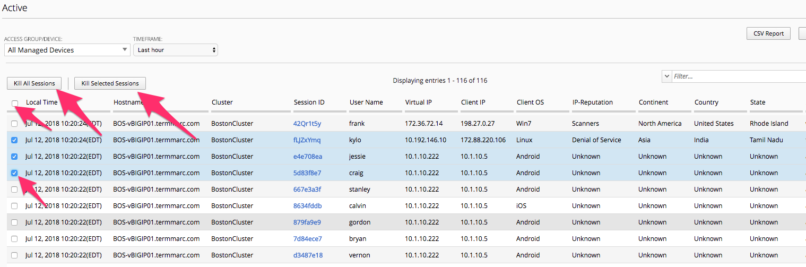
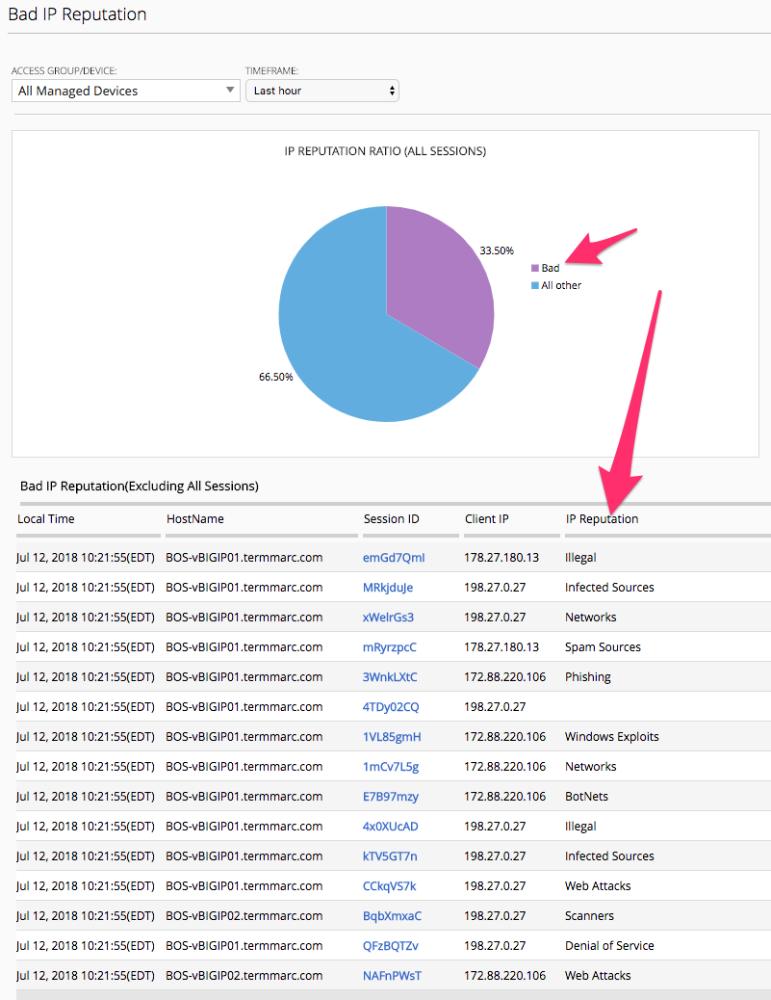
.. |image53| image:: media/image51.png
   :width: 5.13477in
   :height: 2.15598in
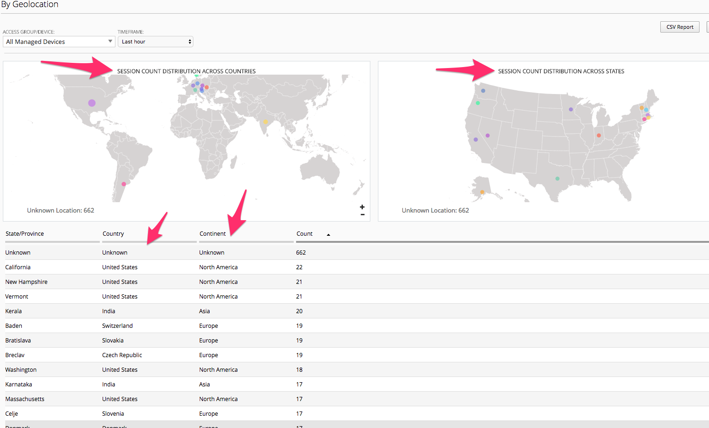
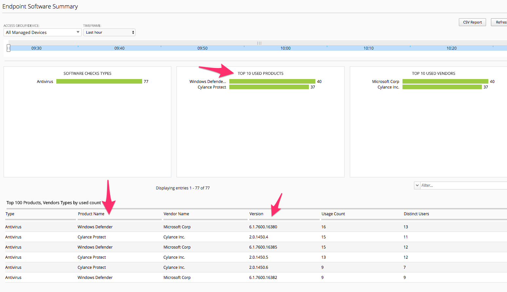
.. |image56| image:: media/image54.png
   :width: 2.26013in
   :height: 0.93738in
.. |image57| image:: media/image55.png
   :width: 6.50000in
   :height: 1.12500in
.. |image58| image:: media/image54.png
   :width: 2.26013in
   :height: 0.93738in
.. |image59| image:: media/image56.png
   :width: 4.62442in
   :height: 1.35400in
.. |image60| image:: media/image57.png
   :width: 3.92659in
   :height: 1.02071in
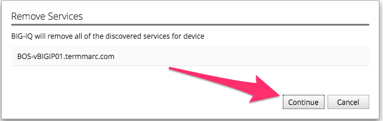
.. |image62| image:: media/image59.png
   :width: 6.50000in
   :height: 1.82639in
.. |image63| image:: media/image60.png
   :width: 4.93125in
   :height: 3.26643in
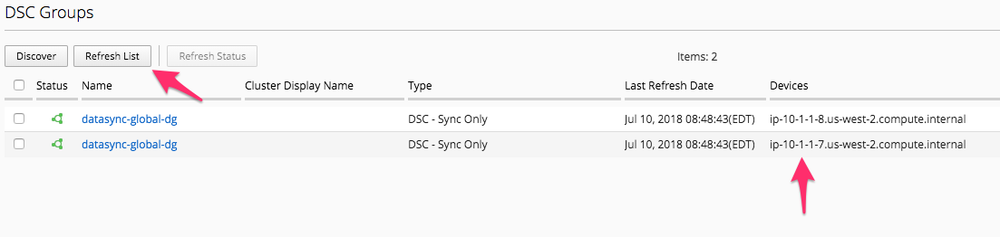
.. |image65| image:: media/image62.png
   :width: 6.35479in
   :height: 5.69259in
.. |image66| image:: media/image63.png
   :width: 6.50000in
   :height: 2.21319in
.. |image67| image:: media/image64.png
   :width: 6.49097in
   :height: 4.43542in
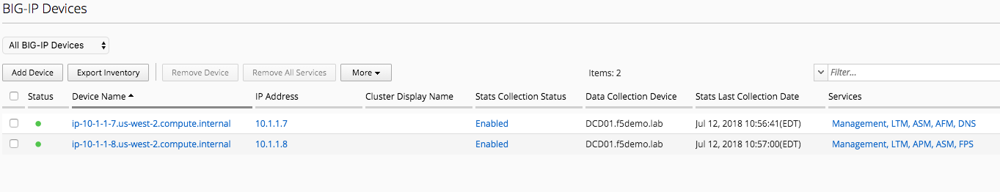
.. |image69| image:: media/image66.png
   :width: 4.46819in
   :height: 2.80173in
.. |image70| image:: media/image67.png
   :width: 1.93125in
   :height: 1.26279in
.. |image71| image:: media/image68.png
   :width: 1.93125in
   :height: 1.06679in
.. |image72| image:: media/image69.png
   :width: 6.49097in
   :height: 2.37014in
.. |image73| image:: media/image70.png
   :width: 2.82256in
   :height: 0.74991in

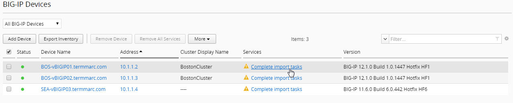
.. |image76| image:: media/image73.png
   :width: 5.84302in
   :height: 4.64525in
